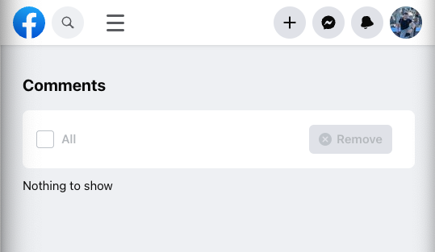

# Facebook Post, Comment, Likes Eradicator



## UPDATE - The code now includes scripts to remove likes and posts too. 

This script automates the process of deleting posts, comments, and likes from your Facebook profile. It uses Selenium with Python to interact with the Facebook acitivty log interface to remove the content.

## Prerequisites

- **Python 3.x**
- **Selenium**: Install using `pip install selenium`
- **Google Chrome**
- **ChromeDriver**: 
  - The repository includes a ChromeDriver binary compatible with macOS. If you're using a different operating system, you'll need to download the appropriate ChromeDriver for your system from the [official site](https://sites.google.com/a/chromium.org/chromedriver/downloads) and ensure it's in the same directory as the script or in your PATH.

## How to Use

### **Step 1: Start a Custom Chrome Instance**

Before running the script, you need to start a custom instance of Google Chrome. This won't interfere with your existing Chrome sessions.

Run the following command in your terminal:

```bash
/Applications/Google\ Chrome.app/Contents/MacOS/Google\ Chrome --remote-debugging-port=9222 --user-data-dir="/tmp/chrome_temp"
```

This command starts a new Chrome instance that the script can attach to without affecting your main Chrome profile.

### **Step 2: Run the Script**
Navigate to the directory containing the script and run either of these commands:

For deleting comments, run: 
```bash
python3 comments-eradicator

```
For archiving facebook posts, run: 
```bash
python3 posts-archiver

```

For undoing likes, run: 
```bash
python3 likes-eradicator

```

### **Step 2: Let the Script Work**

Once the script starts, it will navigate to your Facebook activity log for comments and begin the deletion process. 

The script will continuously check for comments and delete them. If there are no comments left or if there's a delay in loading, the script will wait until the checkbox to select comments becomes clickable again and then continue the deletion process.

## **Notes**

Facebook will occasionally prompt you to write your Facebook password. Just input it and let the program run.

Ensure that the ChromeDriver version matches the version of Chrome you have installed.

The script uses a specific Chrome instance and won't interfere with your regular Chrome sessions.

## **Future Plans**

Creating a click-and-play executable with pyintaller

Ensuring out-of-the-box support for Linux and Windows